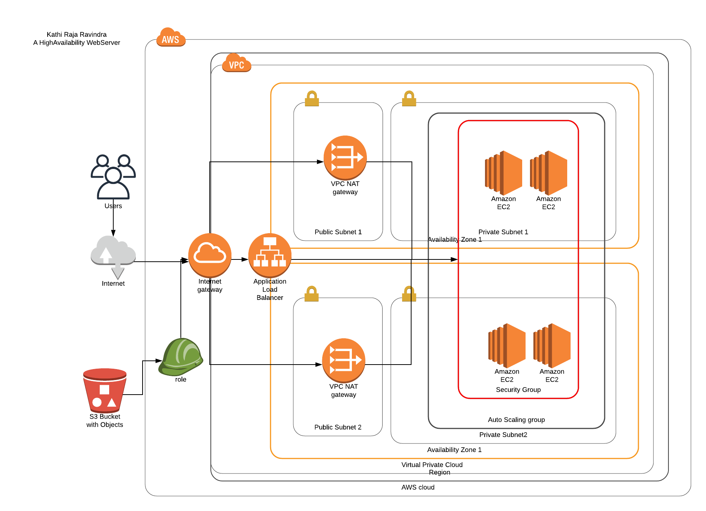

# Udagram.
## A High Availability WebApp.
### This is a AWS CloudFormation Script that could deploy the whole application and infrastructure underneath it.

> Infrastructure Diagram:



>Prerequesties:

* [x] Upload the WebApp into an S3 bucket (_public_).
 
> Usage:

* To construct the networking layer.

```bash

$ cd InfrastructureAsCode
$ chmod +x create.sh update.sh
$ ./create.sh <name> network.yml network_params.json

```

* To create IAM Role for access to S3.

```bash

$ ./create.sh <name> role.yml role_params.json

```

* To instantiate servers along with infrastructure and deploy code from S3.

```bash

$ ./create.sh <name> servers.yml server_params.json

```

> Replace _name_ with your desired string for the stack name.

> _.bat_ files are available so as to run in PowerShell.

> Output:

* URL to the webapp: http://Serve-Udagr-PBRDB6ZJCMM5-218335503.us-east-2.elb.amazonaws.com
> _login with any id/pass to view sample functioning of the site_